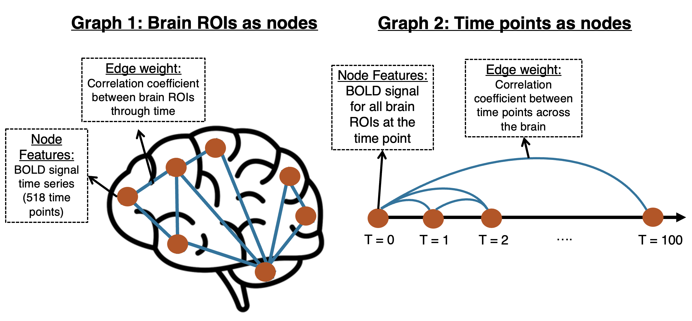
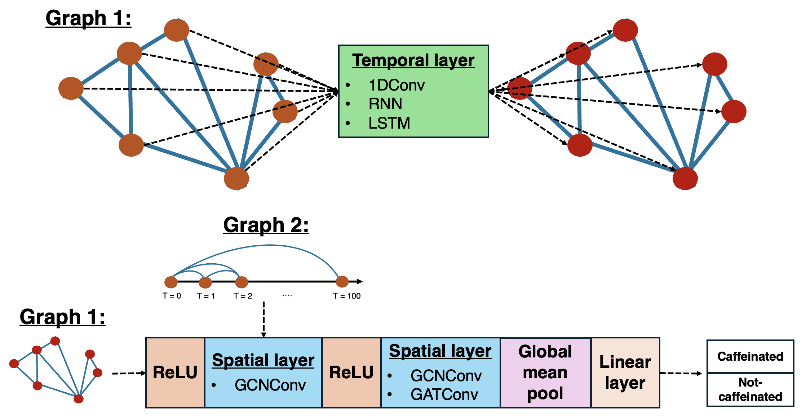

# STGNNBrain: Spatial-Temporal GNN for Brain data
### Predicting Brain-State Using Spatio-Temporal GNNs
We use the MyConnectome dataset, composed of thirty-two 10-minute fMRI scans while a participant was caffeinated and fourty 10-minute fMRI scans while the same participant was fasted. Our task is to leverage Spatiotemporal patterns of brain activity using Graph Neural Networks to classify the state of the participant. 

Please refer to this blog post for a more detailed background and explanation. 

### Graph definition
We define two types of graphs: (1) The brain ROIs are the nodes and (2) The time points are the nodes. 

### Architectures explored

### How to setup?
We recommend copying the `noebooks/colab.ipynb` file into Google Colab to run this project, since that is what was used to test the model. However, we provide a comprehensive guide in this repository. 

## Walkthrough of code

### Preprocessing your data
First step is to download the fMRI resting state data and the confounds. You want to have all the resting state data in a single folder and the confound files for each session in another folder. These can be found [here](https://openfmri.org/dataset/ds000031/). 

Once done, write the paths to each folder in the `config.json` file two. Now you can run the `data_preprocess.py` script, which will (not necessarily in this order):
1. Condense the timeseries for each fMRI into 116 brain ROIs, based on the AAL116 atlas. 
2. Regress the confounds (movement artifacts) out of the time series data. 
3. Z-Score the time series data for each brain ROI.
4. Create a correlation matrix for each fMRI session. 
5. Save the timeseries and connectivity matrices into a folder (specified in the `config.json` file). 

### Creating the graphs
The graphs necessary for training the models are generated in the  `src/STGNNBrain/data.py` script. This file simply loads the labels, timeseries and connectivity matrices. Then, it defines two types of graphs:
1. **Graph 1:** Brain ROIs are the nodes, and each node has the time series as their feature. There is an edge between two brain ROIs if their absolute value correlation is > 0.1. Furthermore, each edge is weighted by the absolute value of the correlation coefficient. 
2. **Graph 2:** Time points are the nodes, and each node has the activity of the brain ROIs as their feature. The correlation between each time point is computed and there is an edge between two time points if the absolute value correlation is > 0.1. Furthermore, each edge is weighted by the absolute value of the correlation coefficient. 

### Defining the models
The model definitions are in the `src/STGNNBrain/models.py` script. We include:
- **Baseline models for Graph 1**: 
    - MLP on the connectivity matrices
    - LSTM (temporal information only)
    - GCN (spatial information only)
- **Baseline models for Graph 2**: 
    - MLP on the connectivity matrices
- **Spatiotemporal models for Graph 1**:
    - Each model first includes a temporal layer to create new features for each brain ROI based on their time series:
        - CNN: Two 1D Convolution on the time series
        - RNN: The output of the last hidden state for each brain ROI. 
        - LSTM: The output of the last hidden state for each brain ROI. 
    - Then, the output is passed through spatial layers. Since we have a small dataset, we included code to decrease the complexity of the model by one layer so that we do not overfit. However, we only report on the more complex models. 
        - More complex: ReLU -> GCNConv -> ReLU -> GCNConv -> Global Mean Pool -> Linear layer | Less complex: ReLU -> GCNConv -> Global Mean Pool -> Linear layer
        - More complex: ReLU -> GCNConv -> ReLU -> GATConv -> Global Mean Pool -> Linear layer | Less complex: ReLU -> GATConv -> Global Mean Pool -> Linear layer
- **Spatial models for Graph 2:**
    - ReLU -> GCNConv -> ReLU -> GCNConv -> Global Mean Pool -> Linear layer
    - ReLU -> GCNConv -> ReLU -> GATConv -> Global Mean Pool -> Linear layer

### Training and Evaluation
The training and evaluation is done in `src/STGNNBrain/fitting.py` script, leveraging helper functions written in `src/STGNNBrain/train.py` script. In particular, we do the following:
- Split the data into 5 folds. 
- For each fold:
    - Train the model for 300 epochs or until convergence (i.e., loss does not decrease significantly after 15 epochs in a row). 
        - CrossEntropyLoss as the loss function
        - Adam Optimizer
    - Test the model on the held out data and save all metrics (accuracy, f1, recall, precision, AUC). 

### Explain the results of the best model
Once we corroborate which is the best model, we design an explainer (using GNNExplainer) to determine the importance of the nodes or features to make the prediction. This is done by maximizing the mutual information between the prediction of the model and the distribution of possible subgraph structures. 

The code for the best model is written in `src/STGNNBrain/explainer.py` script. 

## Future work:
1. If possible, create more samples from the data while avoiding contamination between training and testing set. 
    - This might increase the performance difference between out Graph 1 models and baselines. 
2. Hyperparameter tuning
3. In Graph 2, make the features of each time point be its own spatial graph. 

